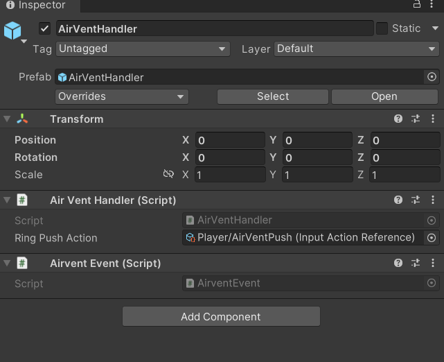
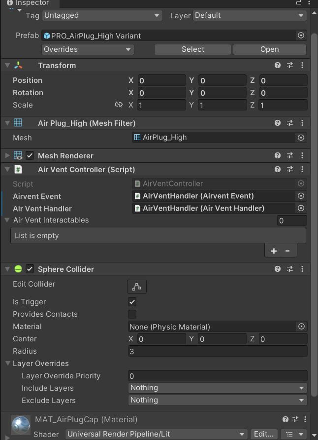
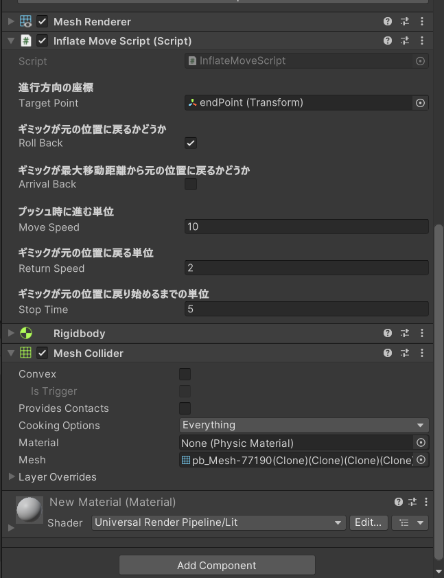

# AirVentに関するマニュアル

## 使い方
　田舎者でもわかるようにしています。

### 0. Unityを立ち上げよう
　バージョンは大丈夫ですか？[環境設定](ConfigurationManual.md)にバージョンの情報は乗っているのでわからなければ確認しにいってください！

### 1. AirVentHandleをSceneに追加しよう。
　prefabsの中にあるモデルをSceneにD＆Dすればおｋです。

### 2. AirVentHandleにScriptをアタッチしよう。
　下記の画像を参考にしてアタッチしてください

### 3.AirVentのモデルに色々アタッチしよう。
　下記の画像を参考にしてアタッチしてください

 

- AirVentInteractablesについて
  
　　　ここには動かしたいオブジェクトをアタッチしてください

- Colliderについて　　
  
　　　ここのColliderはインタラクトできる検知範囲になります。

  
### 4. 動かしたいオブジェクトに色々アタッチしよう。
　下記の画像を参考にしてアタッチしてください
 
 

- Target Pointについて
  
  向かってほしい座標をアタッチすればその方向に移動してくれます。

- Roll Backについて

  一定時間Pushされない時に元の位置に戻るかどうかを選択できます。  
チェックで戻れます。

- Arrival Backについて
  
  オブジェクトが向かってほしい座標に辿り着いた時に元の位置に戻るどうかを選択できます。  
  チェックで戻れます。

- MoveSpeedについて
  
  Pushする際の進むスピードのパラメーターです。
  
- ReturnSpeedについて
  
  Roll Back適用化での戻るスピードのパラメーターです。

- StopTimeについて

   Roll BackとArrivalBackの戻り始めるまでの時間のパラメーターです。

 ### 終わりに
 　わからなかったら報告ください。

  
