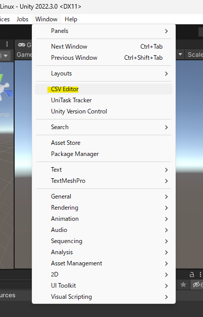
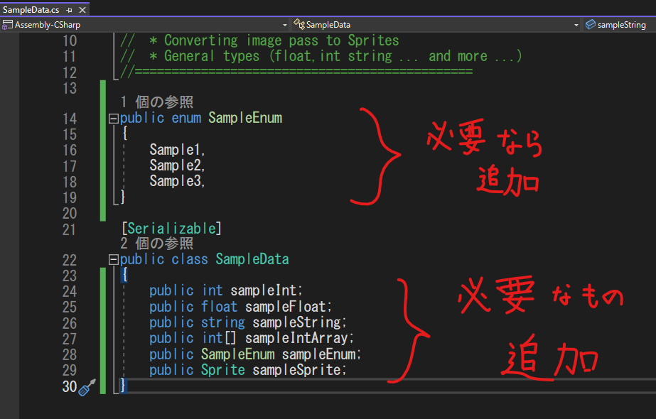
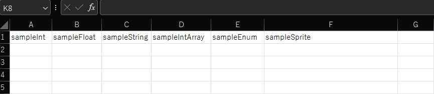
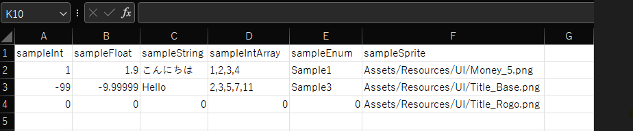
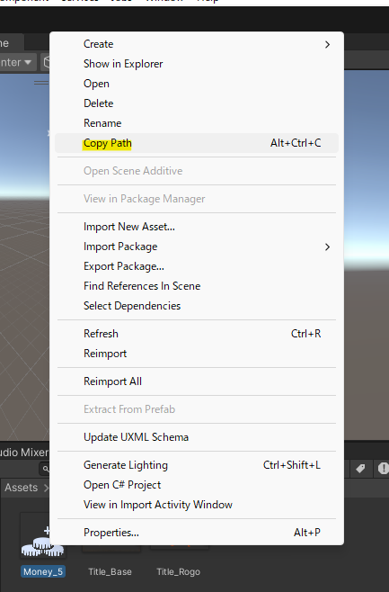

# CSVファイルの生成と環境構築に関するマニュアル

## 目次
- [はじめに](#はじめに)
- [使い方](#使い方)
  - [Unityを立ち上げよう](#0-unityを立ち上げよう)
  - [画面上部のWindowタブを開き、CSVEditorをクリックしよう](#1-画面上部のwindowタブを開きcsveditorをクリックしよう)
  - [画面の指示に従ってCSVファイルを生成しよう](#2-画面の指示に従ってcsvファイルを生成しよう)
  - [生成したCSVファイルを編集しよう](#3-生成したcsvファイルを編集しよう)
  - [スクリプタブルオブジェクトをアタッチしよう](#4-スクリプタブルオブジェクトをアタッチしよう)
- [おまけ](#おまけ)
## はじめに
レベルデザイン等に使用するCSVファイル。生成自体はExcelで簡単にできますが、命名規則や、データの名前を一致させなければならないなど、以外と面倒なことが多いと思うわけです。

そこで、**誰でも簡単に**データを扱えるエディタ拡張を作ってみました。

実際に使ってみて、「使いにくいなぁ…」と感じたら遠慮なく言ってください！直せるところは直します。

## 使い方
さて、早速ですが使い方を覚えていきましょう。簡単なので大丈夫！！

### 0. Unityを立ち上げよう

バージョンは大丈夫ですか？これの執筆時（2023/6/14）では`2022.3.0f1`が採用されています。

### 1. 画面上部のWindowタブを開き、CSVEditorをクリックしよう

### 2. 画面の指示に従ってCSVファイルを生成しよう

各項目の詳細

  
- Step1 ： 【環境の構築】生成するデータの名前を決めよう。
  - **CSVファイルの名前ではありません**
  - このデータはCSVファイルの生成に使うものです。
  - 命名規則は 「末尾に`Data`をつける」と「先頭は大文字」です。`〇〇Data` です。
  - デフォルト値に`SampleData`が入っています。そのSampleを書き換える形でお願いします。
  
- Step2 ： Dataを生成したい地点のパスを指定しよう。
  - **`Assets`フォルダ内を指定してください。**
  - ここで生成したファイルは後ほど使うのでわかりやすい場所を指定しましょう。
  - デフォルト値に`Assets/Scripts`が入っています。
    
- Step3 ： ScriptableObjectの自動生成クラスを生成したい地点のパスを指定しよう。
  - **`Assets`フォルダ内を指定してください。**
  - このファイルは基本使用しません。（当然内部では使用していますが…）
  - Step2と同じ場所を指定すると管理がしやすいと思います。
  - デフォルト値に`Assets/Scripts`が入っています。  
  
- Step4 ： 【データ生成】データを生成しよう。
  - 設定忘れがないかを確認しましょう。
  - ボタンを押すだけです。
  - 3つのファイル（`SampleData.cs` `SampleDataBase.cs` `SampleDataScriptableObjectGenerator.cs`）が生成されます。
    - 各ファイルの`SampleData`をStep1で設定した名前に置き換えて読んでください。
  - **生成後、パスがリセットされるバグ**があります。
    - 連打すると初期位置にも生成されてしまうので連打しないでください。
  
- Step5 ： 【データ編集】データを編集しよう。
  - `SampleData` （Step1で設定した名前）のスクリプトを開きます。
  - 必要なパラメータを TODO の下部に書き込みます。
    - 一般的な型(`int`,`float`,`string`,`配列`など)が使用可能です。
    - `List\<T\>`, `bool` は使えません。特殊な型で使えるのは、`enum`,`Sprite`です。
    

- Step6 ： 【CSVの生成】CSVファイルの名前を指定しよう。
  - 命名規則はそれぞれで異なると思います。ここでは指定しませんが、臨機応変に対応してください。
  - デフォルト値に`Sample_Sample`が入っています。  
    
- Step7 ： CSVファイルを生成したい地点のパスを指定しよう。
  - **`Assets`フォルダ内を指定してください。**
  - ここで生成したファイルはレベルデザイン等で頻繁に使うのでわかりやすい場所を指定しましょう。
  - デフォルト値に`Assets/Resources`が入っています。  
  
- Step8 ： CSVファイルを生成しよう。
  - 設定忘れがないかを確認しましょう。
  - ボタンを押すだけです。
  - 1つのファイル（`Sample_SampleSampleData.csv`）が生成されます。
    - `Sample_Sample`をStep1で設定した名前に置き換えて読んでください。
  - 複数ファイル生成したい場合は、Step6から再度やり直してください。
  
  
各項目の詳細は以上です。

### 3. 生成したCSVファイルを編集しよう
  2-Step5で設定した名前がすでにセルに入っていると思います。
  
  
  
  それらの下に各項目のレベルデザイン値を打ち込みましょう。
  
  
  
  #### 注意点
 - `enum` は 文字列が完全に一致している必要があります。数値でも指定可能です。
 - `Sprite` は 相対パスを指定してください。
   - 簡単にパスを取る方法は 指定したい画像を右クリックして、Copy Pathを選ぶ。
  
    
  
  **編集したら保存するのを忘れないように！！** ctrl+Sを常に押す勢いで…
  
### 4. スクリプタブルオブジェクトをアタッチしよう
  この作業は基本プログラマが行うはずです。ここまできたら作業終了です！
  

作業工程

  プログラマから頼まれた場合は、指定の位置にScriptableObjectをアタッチしましょう。
  
  ScriptableObjectは、.csvがある場所に自動で生成されています。（されていなかったら.csvをリセットしてみてください）
  
  同じ名前で、拡張子が.assetになっているものがScriptableObjectです。

  
## おまけ
  お疲れ様でした！どうでしたか？簡単に作業出来ていたらなによりです。
  
  この機能に関するバグがあったらIssueにお願いします。重大なバグならすぐに修正します
