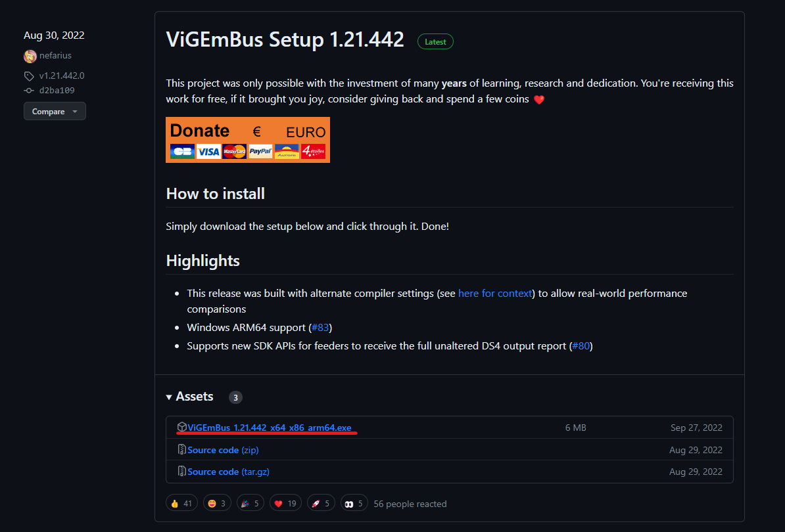
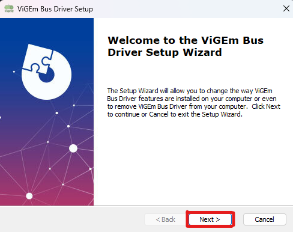

# 環境設定
## 使用ツール
 - Unity2022.3.3f1
   - このバージョンで制作上の不都合等の問題があったら変更する可能性があります。
 - [Ringcon-Driver v1.0.3](https://github.com/ringrunnermg/Ringcon-Driver/releases)
   - バックグラウンドで立ち上げておく必要があります。設定項目がありますので要注意。
   - 当リポジトリ内に、ダウンロードしてセットアップ済みのものを用意してあります。
 - [ViGEmBus](https://github.com/ViGEm/ViGEmBus/releases)
   - Ringcon-Driverに必要なアプリです。仮想コントローラーのために使用するとのこと。
   - こちらはインストール必須のため、ご自身でインストールをお願いします。
     - 下記にインストール方法の詳細は示します。

## Unityにリングコンを接続するには
上記[使用ツール](#使用ツール)から、[ViGEmBus](https://github.com/ViGEm/ViGEmBus/releases)をダウンロード&インストール

ダウンロード&インストール手順

1. リンク先に飛ぶ

2. ダウンロードしたインストーラーからインストール

***

接続方法です。

現在編集中・・・

※常に Ringcon-Driver を立ち上げておく必要があります。
