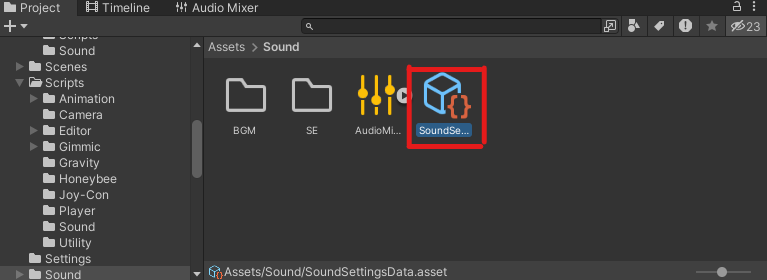
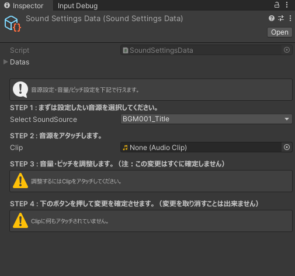
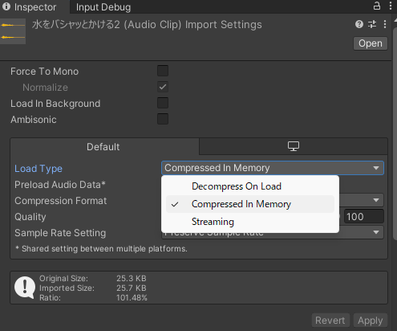
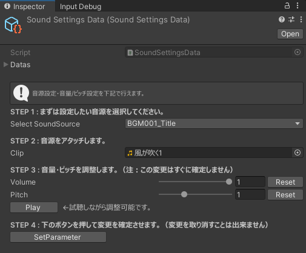

# SoundManager の 使い方

## 目次
- [はじめに](#はじめに)
- [使い方](#使い方)
  - [Unityを立ち上げよう](#0-unityを立ち上げよう)
  - [スクリプタブルオブジェクトを編集しよう](#1-スクリプタブルオブジェクトを編集しよう)
  - [画面の指示に従って音源の設定を行おう](#2-画面の指示に従って音源の設定を行おう)
  - [3D音源の場合](#3-空間が3D音源の場合)

- [おまけ](#おまけ)

## はじめに
音源の音量調整などなど、設定するの大変ですよね。

そこで、**簡単に**一元管理ができるシステムをエディタ拡張で作ってみました。

実際に使ってみて、「使いにくいなぁ…」と感じたら遠慮なく言ってください！直せるところは直します。

## 使い方
さて、早速ですが使い方を覚えていきましょう。簡単なので大丈夫！！

### 0. Unityを立ち上げよう

バージョンは大丈夫ですか？[環境設定](ConfigurationManual.md)にバージョンの情報は乗っているのでわからなければ確認しにいってください！

### 1. スクリプタブルオブジェクトを編集しよう
スクリプタブルオブジェクトで管理しています。  
パスは `Assets/Sound/SoundSettingsData.asset` です！

### 2. 画面の指示に従って音源の設定を行おう
インスペクターに出される各指示の詳細を記載しておきます。

参考画像を表示

- Step1 ： まずは設定したい音源を選択してください。
  - Notionにある[サウンドリスト](https://www.notion.so/64282fc501774928a64d1ad81dbde71e?v=0ceaabc52fb945e0a0a5bf70fe74f7d3&pvs=4)のIDと同じIDを使用しています
  - たとえば、「タイトルBGM ( ID : BGM001 )」を設定したければ、`BGM001_Title`を選択すればOKです
  
- Step2 ： 音源をアタッチします。
  - Unityに導入した音源をD&D、または選択すればOKです。

音源の入れ方

1. `Assets/Sound`の `BGM` と `SE` のどちらかに音源をD&D
2. 画像の設定項目を以下のように設定します
3. 設定したら**Apply**を忘れずに押してください

| 音源の種類 | LoadType |
|:---|:---|
|BGM|Streaming |
|SE |Compressed On Load|

- Step3 ： 音量・ピッチを調整します。
  - **この変更はすぐに確定しません** 
  - 視聴しながらスライダーをいじることで調整が可能です。
    - 3D音源はこの限りではありません。（一応全体の音量のみ調整出来ますが、細かい調整は各AudioSourceでの設定が必要です）
      - 今後アップデート出来たらいいなと思っています
  - **もう一度言いますが、この変更はすぐに確定しません** 

参考画像を表示

- Step4 ： 下のボタンを押して変更を確定させます
  - `SetParameter`というボタンを押すと確定できます。
  - ボタン押下後は変更を取り消すことは出来ません
  - 変更点がある場合は、Resetボタンも表示されるので注意してください

各項目の詳細は以上です。

### 3. 空間が3D音源の場合
2D音源の場合はこの項目はスキップしてOKです。

3D音源にある、減衰パラメータなど詳細設定は各AudioSourceで行う必要があります。

また、聞こえ方が2Dとは異なるため注意が必要です。

## おまけ
  お疲れ様でした！どうでしたか？簡単に作業出来ていたらなによりです。

  3D音源の視聴機能や設定など、もう少し簡単にできるのが理想的ですよね。いずれ対応できたらいいなと思っています。
  
  この機能に関するバグがあったらIssueにお願いします。重大なバグならすぐに修正します
